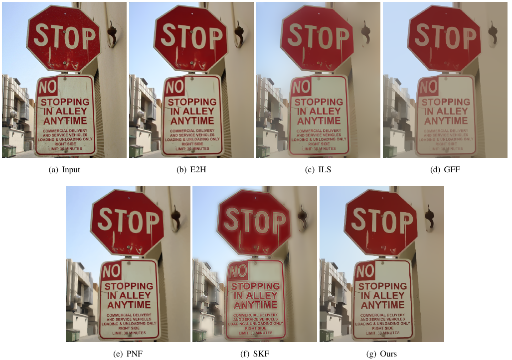
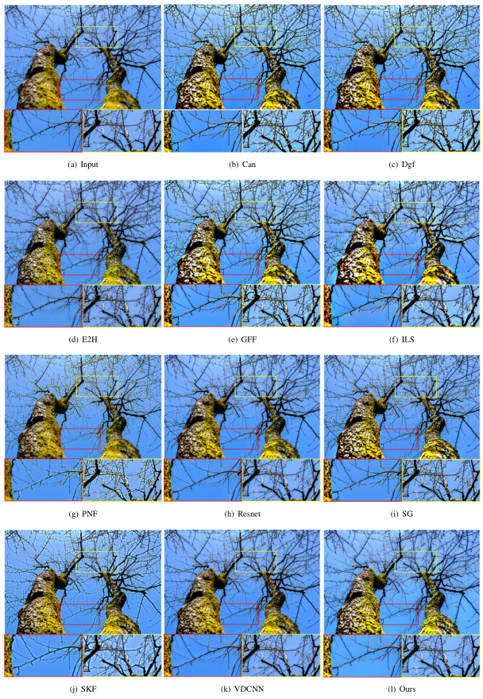
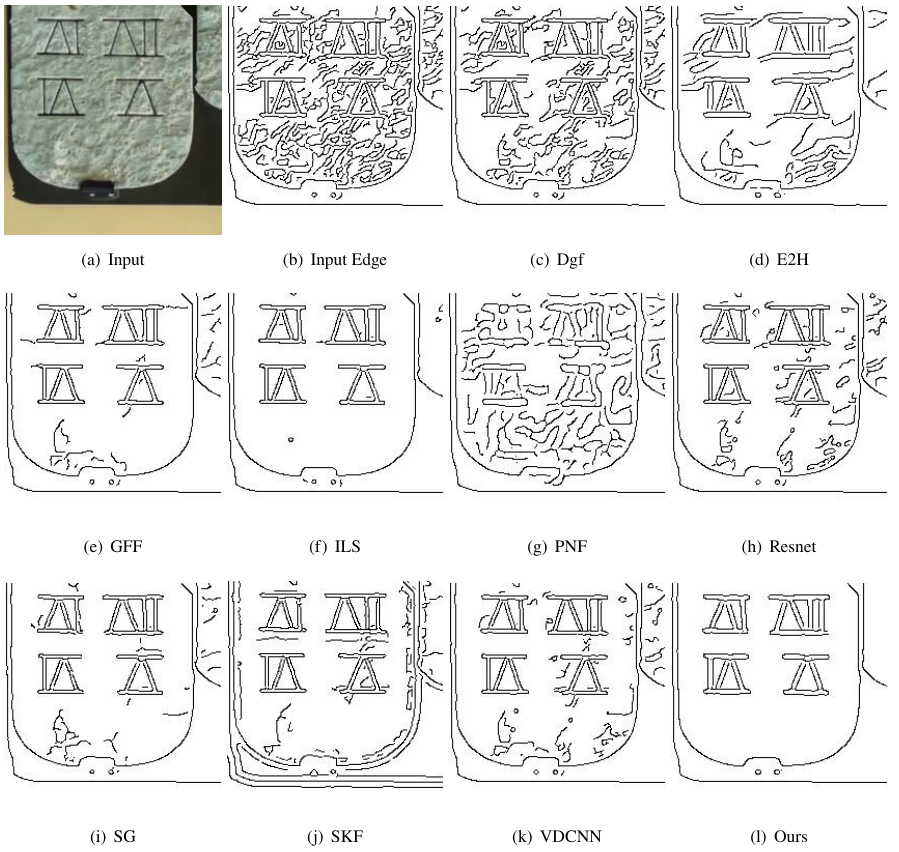
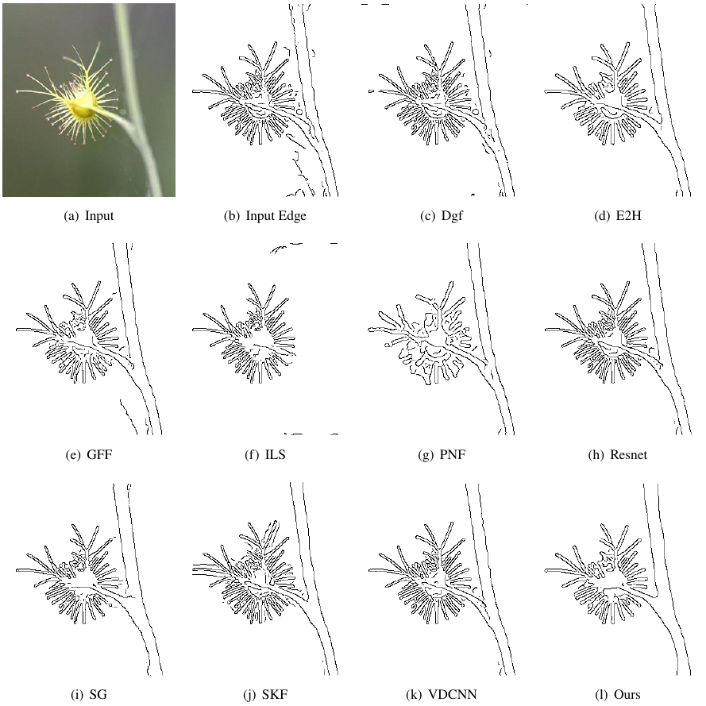

# weighted and truncated L1 smooth

## introduction

This page contains source code, trained model, and more results of the filter for the paper "Weighted and Truncated L1 Image Smoothing based on Unsupervised Learning"

## Instructions
### Prepare Environment
- python = 3.8.6
- pytorch = 1.7.1
- cv2 = 4.4.0
- tensorboardX = 2.1
### Usage  
1. python test.py  
2. python train.py

### More Visual Results

#### Comparison of image smoothing between different methods.

#### Comparison of image enhancing between different methods.

#### Comparison of edge detection between different methods.

