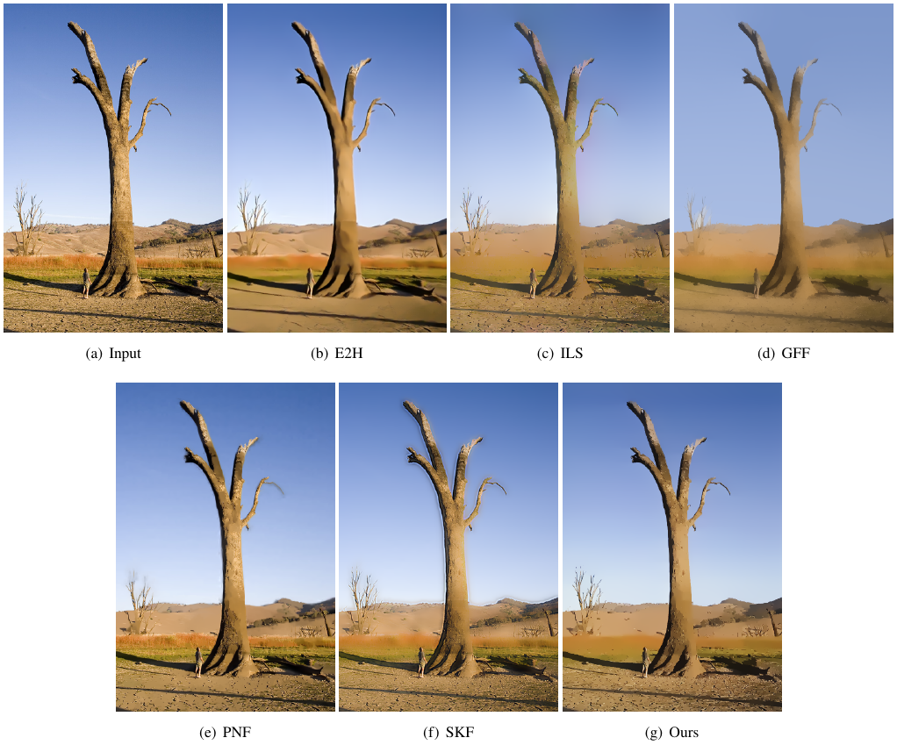

# weighted and truncated L1 smooth

## introduction

Code for Weighted and Truncated L1 Image Smoothing based on Unsupervised Learning and more results

## Instructions

1. python test.py 
2. python train.py

### More Visual Results

#### Comparison of smoothed images by different methods.

#### Comparison of enhance images by different methods.

#### Comparison of edge images by different methods.

