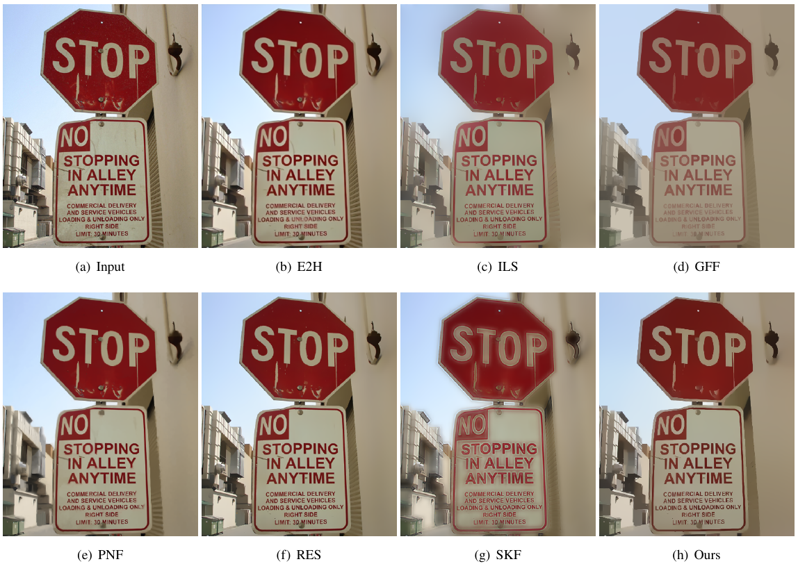

# weighted and truncated L1 smooth

#### 介绍

Weighted and Truncated L1 Image Smoothing based on Unsupervised Learning

#### Instructions

1. python test.py 
2. python train.py

## More Visual Results

Comparison of smoothed images by different methods.

Comparison of enhance images by different methods.

Comparison of edge images by different methods.

